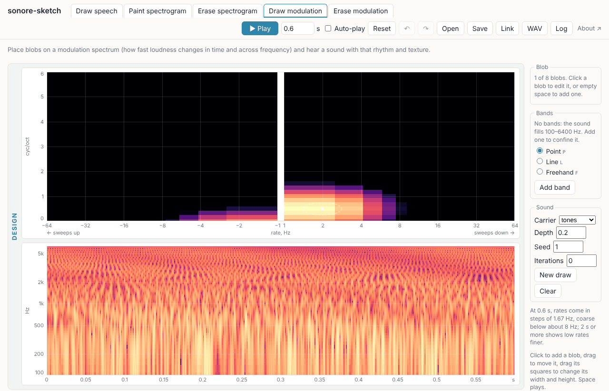

# sonore-sketch

[](https://github.com/choyun1/sonore-sketch/actions/workflows/test.yml)
[](https://github.com/choyun1/sonore-sketch/actions/workflows/pages.yml)
[](LICENSE.txt)
[](pyproject.toml)
[](https://pypi.org/project/sonore/)

Draw on a picture of sound and hear the result.

**Try it: https://choyun1.github.io/sonore-sketch/**

[](https://choyun1.github.io/sonore-sketch/)

Each tab is one of [sonore](https://pypi.org/project/sonore/)'s routes back
to sound, given a point-and-click surface. sonore does the synthesis, in
your browser (Python under Pyodide); this project is only the interface.
There is nothing to install.

## The tabs

| Tab | You draw | You hear | State |
|---|---|---|---|
| **Draw speech** | formant (F1–F5), F0, voicing (AV) and bandwidth tracks over time | the speech Klatt's (1980) synthesizer makes from them, after Track-Draw (Assmann et al., 1994) | built |
| **Paint spectrogram** | level painted on time × log-frequency | a sound whose spectrogram is the painting (sonore's `ripple_sound`) | built |
| **Erase spectrogram** | erasures on a sound's spectrogram (a syllable train, the Draw speech tab's sound, or a recording) | what is left of the sound (sonore's least-squares STFT resynthesis) | built |
| **Draw modulation** | blobs on a modulation spectrum (rate × density), and optional frequency bands | a sound with that modulation (sonore's `ModulationSpectrum.from_blobs`), confined to the bands | built |
| **Erase modulation** | erasures on a sound's modulation spectrum (a syllable train, the Draw speech tab's sound, or a recording) | the sound with that modulation taken out (sonore's `ModulationSpectrum.with_gain`) | built |

## Using it

The first visit loads Python, NumPy, SciPy and sonore into the browser,
which takes 10–20 s; you can draw while it loads. After that, a sound is
made each time you finish a change.

**On every tab**

- **Play** (or Space) plays the sound. Tick **Auto-play** to hear each
  change as soon as it is drawn (for sounds up to 3 s).
- The **duration** (up to 10 s) stretches everything drawn.
- **Undo** and **Redo** (Ctrl+Z, Ctrl+Shift+Z or Ctrl+Y) cover every change.
  **Reset** starts the tab you are on again from its default drawing, at
  the default duration; Undo brings yours back.
- **Save** writes the drawing as JSON, **Open** reads it back, **Link**
  copies an address that opens it, and **WAV** saves the sound. A saved
  file or a link opens on the tab it was made on.
- Every sound is played and saved at the same peak level (−1 dBFS), so a
  change that only turns the whole sound down is not heard; erasing a
  loud part makes the rest louder.
- **Log** shows what the page did and any errors, with Python's traceback.
  Its **Copy** puts the log, the versions and the current drawing on the
  clipboard, for a bug report.

**Draw speech.** Select a track with its button, by clicking its line, or with
the keys 1–5 for F1–F5 and 0 (or `` ` ``) for F0. The tools have keys too:
P, L and F. **Point** adds a breakpoint or drags one;
double-click removes it. **Line** replaces a span with a straight line.
**Freehand** draws a stroke, kept as the fewest breakpoints within a small
tolerance (Douglas & Peucker, 1973). With any tool, dragging a breakpoint's circle up or down moves
it; with Line or Freehand, dragging from a circle along time draws from it
instead. **Bandwidths** shows a strip for the selected formant's bandwidth, and the **F0 axis** can be
spaced in octaves (Log, from 20 to 800 Hz) or in Hz (Linear).

**Paint spectrogram.** Drag to paint at the brush's level (0 dB is the loudest);
right-drag or **Erase** paints silence (B and E switch between them), and
**Clear** erases everything. Size and Softness shape the brush. **Range**
sets the frequencies painted, 100–6400 Hz to start with; changing it keeps
what is painted inside the new range. The **carrier** is what the painting
shapes: log-spaced tones, harmonics of an F0, or noise. The harmonic
carrier sounds only at multiples of F0, which show as faint dashed lines;
paint between them is silent.

**Draw modulation.** The **Design** panels are what you draw: click the plane to
add a blob, drag it to move it, and drag its squares to change its width
and height (up to 8 blobs). **Add band** confines the sound to a band of
frequencies that you reshape on the spectrogram with Point, Line or
Freehand (P, L, F); Delete removes the selected blob, band or breakpoint. The **Result** panels are measured from the sound that came out:
its own modulation spectrum and its waveform, beside what you drew. The
carrier (tones, harmonic or noise), the modulation depth, and the seed
(**New draw** hears another random draw with the same spectrum) are below.

**Erase spectrogram.** Choose a **source**, as on Erase modulation: a
syllable train, the Draw speech tab's sound, or a recording (**Open audio
file…**); a recording opened on either tab can be the other's source too.
The plane shows the source's spectrogram from 0 Hz to half the sampling
rate, on a linear axis so harmonics are evenly spaced lines. Paint on it to
erase that part of the sound (right-drag or **Restore** brings it back);
**Erase**'s **Depth** goes down to -60 dB, which removes it (E and R switch
between Erase and Restore; Erase never makes something already erased
come back). The **Result** panel shows the spectrogram of what came out, in the same
window and on the same scale, with what you erased outlined, and its
waveform. When the duration changes, erasures on a recording or the
syllable train stay at their seconds (those sounds are not stretched),
while on the Draw speech sound they stretch with it.

**Erase modulation.** Choose a **source**: a syllable train made at the
page's duration, the Draw speech tab's sound, or a recording (**Open audio
file…**, which sets the duration to the recording's, up to 10 s). Each
sound made shows the source's modulation spectrum on the plane, with a
centre strip for rates under 1 Hz. Paint on it to erase that modulation
(right-drag or **Restore** brings it back; E and R switch between them);
**Erase**'s **Depth** goes down to -60 dB, which removes it. The presets replace the mask: keep the rates
below some Hz, or remove the downward or upward sweeps. The **carrier** is
the source's own fine structure, tones or noise; **Iterations** search for
a sound whose own modulation comes closer to the edit, which the source's
own fine structure needs to be heard well. The **Result** panels show the
sound that came out: its own modulation spectrum, measured, with what was
erased outlined over it, its spectrogram and its waveform. When an edit needs
envelopes below zero, sonore clips them and a note under the plane says how
much. A recording is kept in saved files but never in links.

## How the sound is made

Every sound is made by sonore 0.5, in `src/sonore_sketch/` (one module per
tab). The design documents in `docs/design/` hold the measurements behind
each choice; this section is the method in one place.

### The common picture: envelopes and their modulation spectrum

The Draw modulation and Erase modulation tabs share one description of a sound.
A cosine filterbank (McDermott & Simoncelli, 2011) splits it into bands
1/12 octave wide from 100 to 6400 Hz. Each band is a slow **envelope** (its loudness over time, sampled
at 1 kHz) times a fast **fine structure** (what is under the envelope).
The envelopes form an array, band by time, and its 2-D Fourier transform
is the **modulation spectrum** (Chi et al., 1999; Singh & Theunissen, 2003): **rate** (Hz) along time and **density**
(cycles/octave) along frequency. A positive rate with a positive density
is a downward sweep, a negative rate an upward one, and density 0 is
modulation shared by every band.

The spectrum the plane shows is only the transform's magnitude. Two
phases are missing from it, and something has to supply them before
there is a sound again:

- the **modulation phase**: when each event happens and how the bands
  line up;
- the **fine structure** under each band's envelope.

The **carrier** is what supplies them. Every route back to sound below is
the same three steps: magnitudes (drawn or edited) and a modulation phase
make envelopes by the inverse 2-D transform; the envelopes multiply each
band's fine structure; the bands are summed. The result is normalized to
RMS 1.

### Draw speech

The tracks are parameters of Klatt's (1980) cascade/parallel formant
synthesizer, given as breakpoints and interpolated in time
(`so.klatt_synthesize`). There is no iteration.

### Paint spectrogram

The painting is read as an amplitude envelope over time and octaves,
bilinearly between cells, and `so.ripple_sound` puts it on a carrier, as
moving ripples are made (Kowalski et al., 1996), but with any envelope: 20
log-spaced tones per octave, the harmonics of F0 (weighted 1/√k for equal
energy per octave), or noise through a 1/24-octave filterbank. Each
component is multiplied by the envelope at its own frequency. A harmonic
carrier has components only at multiples of F0, so paint between them is
silent. There is no iteration.

### Erase spectrogram

The source is analysed with a 32 ms Hann window every 8 ms
(`so.GaborFrame`). The mask is read at each coefficient, bilinearly in
amplitude, and multiplies it; `to_sound()` then gives the sound whose own
STFT is closest to the masked one (least squares; Griffin & Lim, 1984).
Neighbouring coefficients overlap, so not every picture is a sound's
spectrogram, and the result panel shows what came back. With a 5 ms window
an erased band would come back at only −32 dB, which is why the window is
long (`docs/design/tabs/mask.md`, F-M2). There is no iteration.

### Draw modulation

1. **Magnitudes from the blobs.** Each blob is a Gaussian patch of power
   over log rate and density; the patches add, are mirrored so that
   (rate, density) and (−rate, −density) match (as every real envelope's
   spectrum does), and their square root is scaled so that the envelopes
   vary about a mean of 1 by the **depth** (the RMS of the envelopes about
   their mean). Every band gets the same mean: a drawing sets modulation,
   not a spectral shape (`ModulationSpectrum.from_blobs`).
2. **The modulation phase is drawn at random** from the seed. **New draw**
   changes the seed: the same spectrum, another sound.
3. **Envelopes** come from the inverse 2-D transform. They cannot go below
   zero, so a draw that would need it is refused, with the largest depth
   that fits; within 10% of the depth asked, the sound is made at that
   depth instead.
4. **Fine structure**: a steady tone at each band's centre (tones), each
   band of a noise (noise), or each band of a harmonic complex on F0
   (harmonic). The envelopes multiply it and the bands are summed.
5. **Bands**, if any are drawn, are applied last as a time-varying filter:
   a 20 ms STFT whose gain is the band's level within half its width of
   its centre, a raised-cosine skirt of 1/6 octave on each side, and
   −60 dB outside every band.

### Erase modulation

1. The source is analysed as above, which keeps both the magnitudes and
   the source's own modulation phase.
2. The mask is a gain on the magnitudes: 0 dB keeps a cell, −60 dB removes
   it. It is read at each cell of the analysis (the centre column covers
   rates under 1 Hz) and averaged with its mirror image
   (`ModulationSpectrum.with_gain`).
3. Envelopes are rebuilt from the edited magnitudes and the **source's own
   modulation phase**, so the sound keeps its timing wherever nothing was
   cut. Envelopes that come out below zero are clipped, and the note under
   the plane says how many; this is why boosting barely works and cutting
   does (`docs/design/tabs/edit.md`, E-M5).
4. The fine structure is the source's own, or tones, or noise, as chosen.

### Iterations

Putting envelopes on a fine structure is not the end of the story: a fine
structure that fluctuates within a band (noise, or a recording's own) adds
modulation of its own, so the sound, analysed again, has a modulation
spectrum that differs from the target. **Iterations** search for a sound
that comes closer, as Griffin and Lim (1984) do for a spectrogram. Each
round:

1. analyses the current sound through the same filterbank;
2. keeps its fine structure and its modulation phase;
3. imposes the target's magnitudes again (the drawing, or the edited
   source) to make new envelopes, clipped at zero;
4. puts those envelopes on that fine structure, and sums the bands.

Each round costs one analysis and one synthesis, so the page shows a
progress bar and drops a search when the drawing changes.

**On Erase modulation** (0–20, default 5) this is sonore's own
`to_sound(iterations=n)`, taken one round at a time. On the source's own
fine structure an edit is barely heard without it: removing every rate
above 4 Hz leaves 2.5 dB less power at 6–40 Hz with no iterations, 11.6 dB
with 5 and 14.7 dB with 20 (`edit.md`, E-M3).

**On Draw modulation** (0–10, default 0), without bands it is the same search.
With bands it goes back and forth between the two constraints
(`blobs._toward_blobs`): each round divides the envelopes by the gain the
bands gave them, so the bands' own shape and motion are not what the
blobs act on; imposes the blobs' magnitudes on what is left; multiplies
the gain back; and puts the bands on again. The blobs then shape the
modulation *inside* the bands. Ten rounds give back most of what the bands
cost the blobs (+3–7.5 dB on tones and +11–15 dB on noise, in how far the
measured result stands out where the blobs are drawn over where they
are not) and get 85–95% of
what 50 do, at a ceiling set by the bands' width
(`docs/design/tabs/bands.md`, K-M5 and K-M5a). On the harmonic carrier
iterations are offered only with bands: without them the harmonics that
share each band beat at F0 and pull the search away (K-M5b).

### What the Result panels measure

The Result panels analyse the sound that came out the same way as the
plane: the same filterbank, envelopes at 1 kHz and the 2-D transform.
With bands, each band's envelope is first divided by the bands' gain and
weighted by it, so what is shown is the modulation inside the bands, the
same quantity the blobs draw, and the two can be compared directly.

## The same sound in Python

A saved drawing gives the same sound outside the browser:

```python
import json
from sonore_sketch import page

sound = page.synthesize(json.load(open("sketch.json")))
```

## Developing

The page is static: `index.html` and the ES modules in `app/`, with no
build step and no JavaScript dependencies. The Python half, which the page
runs under Pyodide, is in `src/sonore_sketch/` (one module per tab, and
`page.py`, which the page calls). It needs sonore 0.5.

```
pip install -e ".[test]" playwright
python tools/serve.py             # the page at http://localhost:8000/
python -m pytest                  # the Python half, against sonore directly
npm test                          # the page's model (Node 20+, no packages)
python tools/check_page.py        # the page in headless Chromium
```

Open `http://localhost:8000/?engine=local` to run the synthesis in your
own Python instead of the browser: no download, and it works offline.
`tools/check_page.py` uses the local engine by default; add
`--engine pyodide` to test the page as visitors get it. CI runs all three
test commands on every pull request (`.github/workflows/test.yml`), and
`main` is published to GitHub Pages (`.github/workflows/pages.yml`).

Two things to keep in step:

- The sonore version is pinned twice, in `pyproject.toml` and as
  `SONORE_VERSION` in `app/worker.js`.
- `PYTHON_FILES` in `app/worker.js` lists every module in
  `src/sonore_sketch/`. A new module must be added there, or the page fails
  in the browser while the local engine still works.

## Design documents

Every tab is designed before it is built, in `docs/design/`: `app.md` for
the page as a whole, and `tabs/` for each tab (`tracks.md` for Draw speech,
`painted.md` for Paint spectrogram, `blobs.md` and `bands.md` for Draw modulation,
`mask.md` for Erase spectrogram, `edit.md` for Erase modulation).
Each records the measurements behind it, made by the scripts in `tools/`,
and the decisions Cho made.

## Credits

sonore-sketch grew out of TrackDraw (2016), by Adrian Y. Cho and Daniel R
Guest, whose history this repository keeps; the Draw speech tab is after
Assmann et al.'s (1994) Track-Draw. Every sound is made by
[sonore](https://github.com/choyun1/sonore), by Adrian Y. Cho, running in
the browser under Pyodide (The Pyodide development team, 2021).

This project is AI-assisted: much of the code and documentation was drafted
by Claude (Claude Code) for Cho to review. MIT licence (`LICENSE.txt`).
To cite sonore-sketch itself, use GitHub's "Cite this repository"
(`CITATION.cff`).

## References

Assmann, P. F., Ballard, W. J., Bornstein, L., & Paschall, D. D. (1994).
Track-Draw: A graphical interface for controlling the parameters of a
speech synthesizer. *Behavior Research Methods, Instruments, & Computers*,
*26*(4), 431–436. https://doi.org/10.3758/BF03204661

Chi, T., Gao, Y., Guyton, M. C., Ru, P., & Shamma, S. (1999).
Spectro-temporal modulation transfer functions and speech intelligibility.
*The Journal of the Acoustical Society of America*, *106*(5), 2719–2732.
https://doi.org/10.1121/1.428100

Douglas, D. H., & Peucker, T. K. (1973). Algorithms for the reduction of
the number of points required to represent a digitized line or its
caricature. *Cartographica*, *10*(2), 112–122.
https://doi.org/10.3138/FM57-6770-U75U-7727

Griffin, D. W., & Lim, J. S. (1984). Signal estimation from modified
short-time Fourier transform. *IEEE Transactions on Acoustics, Speech, and
Signal Processing*, *32*(2), 236–243. https://doi.org/10.1109/TASSP.1984.1164317

Klatt, D. H. (1980). Software for a cascade/parallel formant synthesizer.
*The Journal of the Acoustical Society of America*, *67*(3), 971–995.
https://doi.org/10.1121/1.383940

Kowalski, N., Depireux, D. A., & Shamma, S. A. (1996). Analysis of dynamic
spectra in ferret primary auditory cortex. I. Characteristics of
single-unit responses to moving ripple spectra. *Journal of
Neurophysiology*, *76*(5), 3503–3523. https://doi.org/10.1152/jn.1996.76.5.3503

McDermott, J. H., & Simoncelli, E. P. (2011). Sound texture perception via
statistics of the auditory periphery: Evidence from sound synthesis.
*Neuron*, *71*(5), 926–940. https://doi.org/10.1016/j.neuron.2011.06.032

The Pyodide development team. (2021). *pyodide/pyodide* [Computer
software]. Zenodo. https://doi.org/10.5281/zenodo.5156931

Singh, N. C., & Theunissen, F. E. (2003). Modulation spectra of natural
sounds and ethological theories of auditory processing. *The Journal of the
Acoustical Society of America*, *114*(6), 3394–3411.
https://doi.org/10.1121/1.1624067
